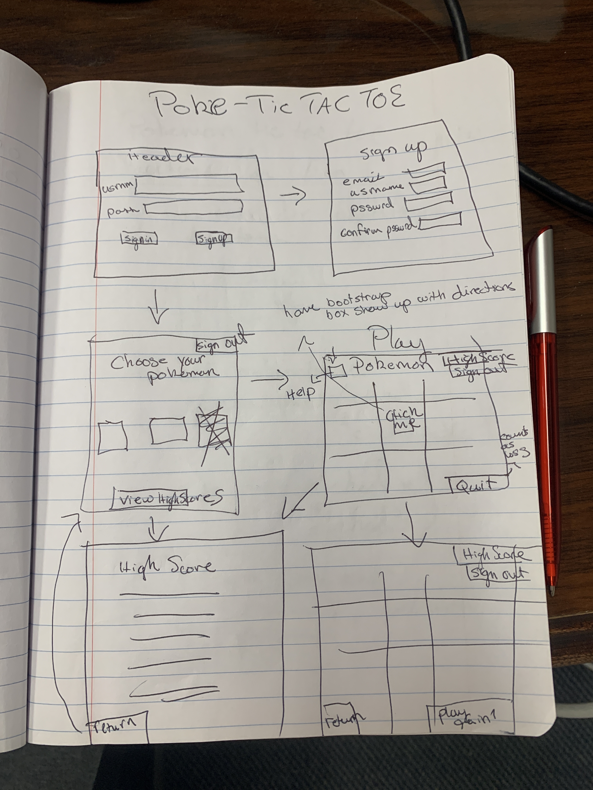

# POKE-TAC-TOE

## About
This project represents basic user functionality for a website that communicates with a database through an api.

I sought out to create a fun and nostalgic Tic-tac-Toe game where users may sign in to record and access their game data, as well as play a friend in a good old fashioned game of Tic-Tac-Toe

In doing so, I tried to recreate the game using the classic 8-bit aesthtic of early gameboy games and Pokemon

## Planning
First I created a wireframe and users stories to physically conceputalize how I wanted the game and layout to look. I then proceeded on coding out the gameboard layout using bootstap to think abou how to implement my game logic using Javascript and jQuery.

## Technologies Used

During this project I used Javascript and jQuerey to create the Tic-Tac-Toe game logic, HTML5 as the basic framework and template for the website, and ajax to communicate via an api to make requests to a data base containing user and game data. Finally I used CSS for styling.

* jQuery
* HTML/CSS
* Bootstrap
* Javascript

## User Stories

* As a user player, I want to be able to sign up, sign in, and change my password

* As a user player, I want to click on a space and have HitmonLee or HitmonChan pop up

* As a user player, I want to be able to choose to play as HitmonLee or HitmonChan for the first move (stretch)

* As a user player, I want to be able to start a new game as soon as three HitmonChans or thee HitmonLees are in a row

* As a user player, I want to have my score recorded

* As a user player, I want to not be able to click on filled in spaces, and be able to click in empty spaces

* As a user player, I don't want to be able to continue to play on the same board as soon as a game ends

* As a user player, I want to view other player's scores (stretch)

* As a user play, I want to have my HitmonLee and HitmonChan have 16bit animations (stretch)

* As a user player, I want to either play a friend or computer (stretch)

## Unsolved Problems

I would like to make the website more responsive and friendlier to mobile screens. Addtionally I would love to build an AI to have the user play against.

## WireFrame

